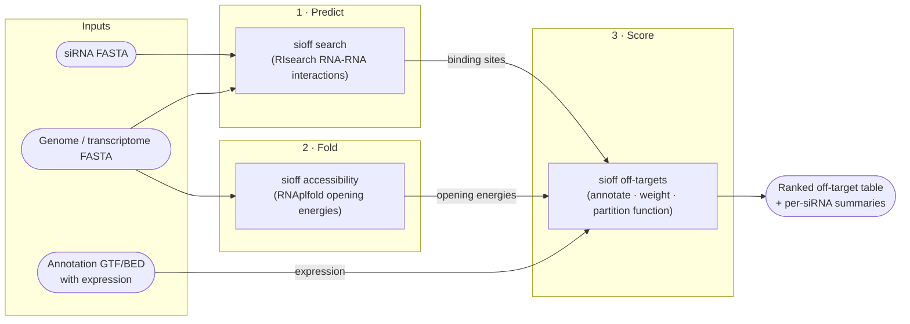

# siOFF

siOFF — siRNA off-target discovery pipeline.

A bioinformatics pipeline for **siRNA off-target discovery and probability quantification**. Integrates RNA-RNA interaction predictions with transcriptome annotations, RNA accessibility profiling, and thermodynamic modeling to rank off-target binding sites.

siOFF is a from-scratch re-implementation of the siRNA off-target discovery
pipeline originally distributed with
[RIsearch2](https://rth.dk/resources/risearch)
([Alkan *et al.*, Nucleic Acids Research 2017](https://doi.org/10.1093/nar/gkw1325)).
It keeps the same thermodynamic model and can read the same RIsearch2
prediction files, but replaces the original Perl/C toolchain with a single
Python package built on Polars, adds in-process RIsearch bindings (Rust/PyO3),
Parquet-based accessibility profiles, and a Slurm-aware orchestrator. A
compatibility mode (`--legacy-format`) reproduces the old `.results` output.

The pipeline has three stages, mapped one-to-one onto CLI commands:



Rounded nodes are data, rectangles are pipeline stages. Stages 1 and 2 are
independent and can run in parallel; stage 3 combines their outputs. Stage 1
can be skipped entirely if you already have RIsearch2 prediction files —
`sioff off-targets` reads them directly.

---

## Installation

### Prerequisites

- **Python ≥ 3.11** (tested on 3.11–3.14)
- **[uv](https://docs.astral.sh/uv/)** (recommended) or pip
- For the full install (in-process `index`/`search`): **SSH access to the
  private `risearch` repository** and a **Rust toolchain**
  ([rustup](https://rustup.rs)) to build its PyO3 bindings
- ViennaRNA is installed automatically as a Python dependency (pinned 2.7.2) —
  no system-level install needed

### Install

```bash
git clone git@github.com:lorenzo-22/siOFF.git
cd siOFF

# Create virtual environment and install dependencies
uv venv && source .venv/bin/activate
uv sync    # full pipeline, including the in-process index/search commands

# Verify
sioff --help
```

Plain `uv sync` installs the complete pipeline: the `risearch` dependency group
is part of `tool.uv.default-groups`, so the in-process `index` / `search`
commands work out of the box. Installing it requires SSH access to the private
`risearch` repository and a Rust toolchain. Without that access:

```bash
uv sync --no-group risearch
```

installs the core `off-targets` / `accessibility` pipeline, which runs on
pre-computed RIsearch2 predictions (`risearch` is imported lazily and only
needed for `index` / `search` and the `--sirna-fasta` in-process mode).
See [The `risearch` dependency](#the-risearch-dependency) for details.

---

## Quick start: run the bundled example

The repository ships a small, internally consistent example dataset in
[`examples/data/`](examples/data): a 6 kb toy genome, 5 siRNAs, an annotation
with expression values, pre-computed RIsearch predictions, and pre-computed
accessibility profiles. This run works on the core install (no `risearch`
needed) and takes a few seconds:

```bash
# Pre-computed predictions file
sioff off-targets \
  -r examples/data/predictions.out \
  -t examples/data/annotation.gtf \
  -a examples/data/accessibility \
  -o example_run/off_targets.tsv
```

The same run expressed as a YAML config (the config is the complete, commented
reference for every option):

```bash
sioff -c example_yaml/off-targets.example.yaml
```

Both produce the same table; the YAML run writes to
`example_yaml/sioff_example_out/`.

### What you get

`example_run/` contains the main table `off_targets.tsv` — one row per
annotated binding site, ranked by off-target probability — plus one
`<sirna_id>.summary` file per siRNA with its partition-function statistics.
The key columns:

| Column | Description |
|--------|-------------|
| `sirna_id` | siRNA the site belongs to |
| `chrom`, `start`, `end`, `strand` | Binding site location |
| `gene_id`, `transcript_id` | Overlapping annotation feature |
| `energy` | Duplex hybridization energy from RIsearch (kcal/mol) |
| `opening_energy` | Accessibility penalty — cost to unfold the site (kcal/mol) |
| `dG_total` | `energy + opening_energy` |
| `exp_value` | Expression of the overlapping transcript (e.g. RPKM) |
| `P_off_target` | Off-target probability (per-siRNA partition function) |

For example, `siRNA_4` has two equally strong binding sites in the toy data;
the site in the higher-expressed gene absorbs most of the probability:

```
sirna_id  gene_id  energy    dG_total  exp_value  P_off_target
siRNA_4   gene_6   -34.15    -28.35    600        0.727
siRNA_4   gene_5   -34.15    -28.85    100        0.273
```

The full column list is documented in [Output](#output).

## Full example: recompute everything from FASTA

The quick start consumed pre-computed predictions and accessibility profiles.
This example rebuilds both from the raw example FASTA files — the same three
stages you will run on your own data. It requires the full install (the
`risearch` group).

```bash
# 1 · Fold: accessibility profiles, one Parquet file per chromosome
sioff accessibility \
  -f examples/data/genome.fa \
  -o example_run/accessibility

# 2 · Predict + 3 · Score in one command: RIsearch runs in-process
#     on the siRNA FASTA, then sites are annotated and scored
sioff off-targets \
  -s examples/data/sirnas.fa \
  --target-fasta examples/data/genome.fa \
  -t examples/data/annotation.gtf \
  -a example_run/accessibility \
  -o example_run/off_targets.tsv
```

This produces the **same table as the quick start** — the bundled
`predictions.out` and `accessibility/` were generated exactly this way (see
[`examples/generate_example_data.py`](examples/generate_example_data.py)).

For repeated searches against the same target, build the index once and reuse
it:

```bash
sioff index examples/data/genome.fa -o example_run/genome.idx

sioff off-targets \
  -s examples/data/sirnas.fa \
  -idx example_run/genome.idx \
  --target-fasta examples/data/genome.fa \
  -t examples/data/annotation.gtf \
  -a example_run/accessibility \
  -o example_run/off_targets.tsv
```

Standalone prediction (stage 1 by itself) is also available as
`sioff search query.fa target.idx -t target.fa` — see the
[CLI reference](#cli-reference).

---

## Running on your own data

### What you need

1. **siRNA guide strands** — FASTA, one entry per siRNA (RNA or DNA alphabet).
2. **Target sequences** — genome or transcriptome FASTA. This decides the
   analysis mode: `--type gw` (genome-wide, default) intersects predictions
   with the annotation by genomic coordinates; `--type tw`
   (transcriptome-wide) matches the prediction's target ID against
   `transcript_id` directly.
3. **Annotation with expression** — GTF, GFF3, BED6 or BED7. Expression is
   read from an attribute of your choice (`--expression-metric`, default
   `RPKM`) — annotate your GTF with RPKM/TPM values from your expression data
   first. Sites that don't overlap any feature are dropped.
4. Either **pre-computed RIsearch2 predictions** (TSV / `.out.gz` / directory
   of per-siRNA Parquet files) **or** the full install so siOFF can run
   RIsearch itself.
5. Optional: a TSV mapping `sirna_id → transcript_id` (`--on-target-ids`) so
   each siRNA's intended target enters the partition function as the on-target
   term.

### Step 1 — RIsearch predictions

If you already have RIsearch2 output, skip this step and pass the file (or a
directory of per-siRNA Parquet files, which enables parallel per-siRNA
processing) to `-r`.

Otherwise, let `off-targets` run RIsearch in-process via `-s/--sirna-fasta` +
`--target-fasta` (as in the full example above). For a full genome, build the
index once with `sioff index genome.fa` (suffix-array construction is the
expensive part) and pass it with `-idx`; search parameters (seed length,
energy threshold, extension, energy matrix) are documented under
[`sioff search`](#search).

### Step 2 — Accessibility profiles

```bash
sioff accessibility -f genome.fa -o accessibility/ -j 8
```

Writes one `{chrom}.accessibility.parquet` per chromosome with RNAplfold
unpaired probabilities (window `-W 80`, span `-L 40`, unpaired length
`-u 30` by default — change them consistently if your protocol differs).
Chromosomes fold in parallel (`-j`, one worker per chromosome). This is the
most compute-intensive stage: budget hours and tens of GB of memory for a
mammalian genome — run it on a cluster (see
[Orchestrated runs](#orchestrated-multi-step-runs-local--slurm)) and reuse
the profiles across all subsequent analyses of that genome.

Accessibility is optional: without `-a`, opening energies are 0 and ranking
uses hybridization energy and expression only.

### Step 3 — Off-target analysis

```bash
sioff off-targets \
  -r predictions.out \
  -t annotation.gtf \
  -a accessibility/ \
  --expression-metric RPKM \
  --type gw \
  --on-target-ids on_target_map.tsv \
  -o results/off_targets.tsv
```

Useful knobs: `--alpha/--gamma/--theta` for parameter sweeps (semicolon-
separated values, each combination adds a `P_off_target:...` column),
`-j` for worker count, `--output-format parquet` for large runs,
`--legacy-format` for the old pipeline's `.results` output. Prefer the YAML
config for reproducibility — [`example_yaml/off-targets.example.yaml`](example_yaml/off-targets.example.yaml)
documents every option; run it with `sioff -c my-config.yaml`.

### Orchestrated multi-step runs (local + Slurm)

`scripts/run_pipeline.py` runs all stages in dependency order from one config —
`index` and `accessibility` in parallel, `off-targets` after `accessibility`.
It ships in the repo (`scripts/`), not as an installed console script.

```bash
# Dry-run (print commands without executing)
python scripts/run_pipeline.py --config example_yaml/run-pipeline.example.yaml --dry-run

# Run locally (sequential, logs to logs/<timestamp>/)
python scripts/run_pipeline.py --config example_yaml/run-pipeline.example.yaml

# Run a subset of steps
python scripts/run_pipeline.py --config example_yaml/run-pipeline.example.yaml --steps accessibility,off-targets

# Submit to Slurm (add --dry-run to preview the sbatch dependency chain)
python scripts/run_pipeline.py --config example_yaml/run-pipeline.example.yaml --slurm
```

Slurm resources come from the YAML config's `slurm:` key, with per-step
overrides; CLI flags (`--partition`, `--time`, `--mem`, `--cpus-per-task`,
`--account`) override YAML for all steps. Each step logs to
`logs/<timestamp>/`.

```yaml
slurm:
  partition: batch
  account: mylab
  accessibility:          # per-step overrides
    time: "08:00:00"
    mem: 32G
    cpus_per_task: 8
  off_targets:
    time: "04:00:00"
    mem: 128G
    cpus_per_task: 16
```

#### Multiple transcriptomes (fan-out)

Add a top-level `transcriptomes:` list to analyze several genomes/transcriptomes in one launch — Slurm-native, **one transcriptome per node**, run in parallel. Each entry is an independent run (its own predictions, annotation, and output); groups never mix, so the off-target probability math (`Z_s`) is unchanged. The top-level `off_targets:`/`accessibility:` blocks act as shared defaults; each group overrides its per-group fields. `index` is never fanned out.

```yaml
steps: [off-targets]

off_targets:            # shared defaults for every group
  alpha: "0.8;1.0"
  type: gw

transcriptomes:
  - name: human         # required — job names, logs, default output
    risearch_file: ../data/human.out
    transcriptome: ../data/human.gtf
    accessibility_dir: ../data/human_acc/   # precomputed
    output: results/human.tsv               # must be unique per group
  - name: mouse
    risearch_file: ../data/mouse.out
    transcriptome: ../data/mouse.gtf
    accessibility_dir: ../data/mouse_acc/
    output: results/mouse.tsv
```

Each group submits its own Slurm job(s) (`rip_off_targets_human`, `rip_off_targets_mouse`, …); a group's `off-targets` waits only on its own upstream jobs. To compute accessibility per group, add `accessibility` to `steps` and give each group **both** a `fasta:` and an `accessibility_dir:` (the profiles are written there and read back by that group's off-targets; both are required and validated). Omitting a group `output` defaults it to `results/<name>.tsv`.

See [`example_yaml/run-pipeline.example.yaml`](example_yaml/run-pipeline.example.yaml)
for the full orchestrator config reference; all paths resolve relative to the
config file's directory.

---

## CLI Reference

### Global options

Available on `sioff` itself, before any subcommand.

| Flag | Description |
|------|-------------|
| `-c / --config` | Path to a YAML config file; runs the command named in it. Top-level only — `sioff -c cfg.yaml`, not `sioff off-targets -c cfg.yaml` |
| `-v / --verbose` | Enable DEBUG-level logging |
| `--version` | Print the installed version and exit (long form only — `-v` is `--verbose`) |

### `off-targets`

| Flag | Description |
|------|-------------|
| `-r / --risearch-file` | Pre-computed predictions (TSV, `.out.gz`, or directory of Parquet files — directory triggers parallel per-siRNA mode) |
| `-s / --sirna-fasta` | siRNA FASTA — runs RIsearch in-process via PyO3 bindings |
| `--target-fasta / --genome` | Target FASTA for in-process RIsearch |
| `-idx / --target-index` | Pre-built RIsearch index (speeds up repeated runs) |
| `-t / --transcriptome` | GTF, GFF3, BED6 or BED7 annotation file |
| `-a / --accessibility-dir` | Directory of per-chromosome accessibility Parquet files (from `accessibility` command) |
| `--expression-metric` | GTF attribute for expression weighting (default: `RPKM`) |
| `--type` | `gw` (genome-wide) or `tw` (transcriptome-wide, default: `gw`) |
| `--alpha / --gamma / --theta` | Parameter sweep values (semicolon-separated, e.g. `0.8;1.0`) |
| `--on-target-ids / -oi` | TSV mapping `sirna_id → transcript_id` for on-target normalization |
| `-j / --workers` | Parallel worker processes (default: CPU count) |
| `-o / --output` | Output file path (TSV by default) |

### `accessibility`

| Flag | Description |
|------|-------------|
| `-f / --fasta` | Genome or transcriptome FASTA |
| `-o / --output` | Output directory (one `{chrom}.accessibility.parquet` per chromosome) |
| `-W / --window` | RNAplfold window size W (default: 80) |
| `-L / --span` | Max base-pair span L (default: 40) |
| `-u / --unpaired` | Unpaired probability length u (default: 30) |
| `-T / --temperature` | Folding temperature °C (default: 37.0) |
| `-j / --workers` | Parallel workers, one per chromosome (default: 1) |

### `index`

| Flag | Description |
|------|-------------|
| `TARGET` | Target FASTA file to index (positional) |
| `-o / --output` | Output index path (default: `<target>.idx`) |

### `search`

| Flag | Description |
|------|-------------|
| `QUERY INDEX` | Query siRNA FASTA and pre-built `.idx` (positional) |
| `-t / --target` | Target FASTA used to build the index |
| `-s / --seed` | Seed spec, RIsearch2 syntax: `l`, `n:m` or `n:m/l` (default: 6) |
| `--no-gu-seed` | Forbid G:U wobble pairs inside the seed (RIsearch2 `--noGUseed`) |
| `-z / --matrix` | Energy parameter set: `t04` (default), `t99`, `slh04`, `s95-rna-dna`, `s95-dna-rna` |
| `-e / --max-extension` | Max extension length on each side (default: 20) |
| `-E / --energy` | Energy threshold in kcal/mol (default: −10.0) |
| `-o / --output` | Output TSV file (default: stdout) |

---

## Python API

siOFF can be used as a library — `import sioff`, then call the commands as plain functions; they return their results in-memory.

```python
import sioff

# Off-target analysis on a pre-computed predictions file → polars.DataFrame
df = sioff.off_targets(risearch_file="predictions.tsv", gtf_file="annotations.gtf")

# Pre-compute per-chromosome accessibility profiles → dict[chrom -> polars.DataFrame]
profiles = sioff.accessibility(genome="genome.fa")

# Build a RIsearch index → Path (needs the external 'risearch' package)
idx = sioff.index("target.fa")

# Run a RIsearch search → polars.DataFrame (needs the external 'risearch' package)
hits = sioff.search("query.fa", "target.fa.idx", target="target.fa")
```

**Notes**

- `sioff.off_targets` returns a `polars.DataFrame` when given a single predictions file. With a **directory** of per-siRNA Parquet files it returns a **generator** yielding one `polars.DataFrame` per siRNA; iterate it to consume the results. Neither form writes files — the API layer returns results in memory, and writing output is the CLI's job.
- `sioff.accessibility` likewise writes nothing: it returns `dict[chrom -> polars.DataFrame]`. Use the `accessibility` CLI command (or `sioff -c <config>`) if you want `{chrom}.accessibility.parquet` files on disk.
- On bad input the API functions raise ordinary Python exceptions — `FileNotFoundError` or `ValueError` — not `typer.Exit`. `typer.Exit` is raised only by the CLI layer for its own argument validation.
- `sioff.index` / `sioff.search` require the external `risearch` package — the same dependency the CLI's `index`/`search` commands need.

---

## Thermodynamic Model

Off-target probability is computed from a Boltzmann partition function over all predicted binding sites for each siRNA:

```
W_i  = Expression_i × exp(−ΔG_total_i / RT)

       ΔG_total = ΔG_hybridization + ΔG_opening

Z_s  = Σ W_i  (all off-targets of siRNA s)  +  W_on-target

P(off-target_i | siRNA_s) = W_i / Z_s
```

- **ΔG_hybridization**: duplex interaction energy from RIsearch. The nearest-neighbour parameter set is selectable with `sioff search -z/--matrix` (default Turner 2004).
- **ΔG_opening**: Accessibility penalty — cost to unfold the target region, retrieved from pre-computed `RNA.pfl_fold_up` profiles.
- **Expression weighting**: annotation-derived RPKM/TPM values scale each site's contribution.
- **Per-siRNA normalization**: Partition functions are computed independently per siRNA; mixing them is biologically incorrect.

### Parameter sweeps

`--alpha`/`--gamma` clamp extremely favorable energies; `--theta` scales energy differences around a −10 kcal/mol reference. All combinations are computed in a single Polars `group_by` pass, producing separate `P_off_target:alpha=X,gamma=Y` columns.

---

## Output

### TSV (default)

| Column | Description |
|--------|-------------|
| `chrom` | Chromosome or transcript ID |
| `start`, `end` | Binding site coordinates |
| `strand` | Strand orientation |
| `energy` | Hybridization energy (kcal/mol) |
| `opening_energy` | Accessibility penalty (kcal/mol) |
| `dG_total` | Combined free energy |
| `exp_value` | Expression level |
| `P_off_target` | Off-target probability (baseline α=γ=θ=1) |
| `P_off_target:alpha=X,gamma=Y` | Per-parameter-set probabilities |

One `<sirna_id>.summary` file per siRNA is written next to the output with the
partition-function statistics (`P`, `Z`, `Zoff`, with and without
accessibility). `--summary-only` skips the per-prediction table — the old
pipeline's default behaviour.

### Legacy `.results` (optional, `--legacy-format`)

```
# On-target info for siRNA #
# For alpha=1.0 and gamma=1.0; Pon: 0.847; Poff: 0.153; ...
## End of on-target info ##
```

---

## Performance

| Dataset | Time | Memory |
|---------|------|--------|
| 1 k predictions | ~0.2 s | ~80 MB |
| 10 k predictions | ~0.8 s | ~145 MB |
| 100 k predictions | ~6.5 s | ~200 MB |

Key optimizations:
- **Polars** throughout — Rust-backed columnar operations, lazy query planning.
- **Parquet accessibility profiles** — memory-mapped columnar lookup, no full-file reads.
- **ProcessPoolExecutor with Arrow IPC** — per-siRNA files processed in parallel; workers share transcriptome pages via OS page cache.
- **Single `group_by` pass** — all parameter-sweep columns computed in one aggregation.

---

## Dependencies

| Package | Purpose |
|---------|---------|
| `polars` | High-performance DataFrames |
| `pyarrow` | Parquet I/O and Arrow IPC |
| `viennaRNA 2.7.2` | RNA folding (`RNA.pfl_fold_up`) |
| `numpy` | Memory-mapped array operations |
| `biopython` | FASTA parsing |
| `typer` | CLI framework |
| `rich` | Progress bars and terminal output |
| `loguru` | Structured logging |
| `omegaconf` | YAML config loading |
| `ncls` | Interval tree for genomic intersection |

### The `risearch` dependency

The `risearch` PyO3 bindings power the **in-process `index` and `search`**
commands (computing RNA-RNA interaction predictions in-process) and are part of
the default install. The core off-target analysis — `off-targets` and
`accessibility` running on **pre-computed** RIsearch output (TSV / `.out.gz` /
Parquet) — works **without** `risearch` installed; it is imported lazily.

`risearch` is currently fetched from a **private** repository over SSH and is
**not on PyPI**, so the default `uv sync` requires SSH access to that repo
(use `uv sync --no-group risearch` without it):

```
git+ssh://git@github.com/saiden89/risearch.git@1a03a47…#subdirectory=bindings/python
```

The commit is pinned rather than tracking a branch so that installs are
reproducible: `risearch` is a fast-moving repository whose public API and search
results have both changed across releases, so the pin is bumped deliberately and
verified, not automatically.

### Publishing / PyPI

The PyPI distribution name and the import name are both **`sioff`**
(`pip install sioff`, `import sioff`).

`risearch` is declared as a [PEP 735](https://peps.python.org/pep-0735/)
dependency group rather than a normal dependency only because it is not yet on
PyPI: a `git+ssh` direct reference inside `[project.dependencies]` is copied
verbatim into the published `Requires-Dist` metadata, and PyPI rejects
distributions carrying a direct URL. A dependency group is resolver-only and
never reaches that metadata, so the package stays publishable while `risearch`
remains a private git repository. Once `risearch` is published on PyPI, it moves
into `[project.dependencies]` as a normal version pin so that
`pip install sioff` brings in the full pipeline, in-process `index` / `search`
included.

Until then, users installing `sioff` from PyPI get the `off-targets` /
`accessibility` pipeline; the in-process `index` / `search` commands additionally
need `risearch` installed from git (see above).

---

## Related: Rust RIsearch Core

`risearch` is a separate Rust project providing the RIsearch core and its PyO3
Python bindings, installed as the `risearch` dependency (see
[Installation](#installation)). The pipeline calls the bindings **in-process** —
no subprocess, no intermediate TSV. Features:

- Suffix-array based seed-and-extend search
- Selectable nearest-neighbour parameter sets: Turner 2004 (default) and 1999 for RNA-RNA, SantaLucia-Hicks 2004 for DNA-DNA, and Sugimoto 1995 for RNA/DNA hybrids
- Multi-threaded parallel search via Rayon
- SIMD-optimized alignment kernels

The **previous generation** of this pipeline — RIsearch2 and its Perl-based
siRNA off-target discovery scripts — remains available at
[rth.dk/resources/risearch](https://rth.dk/resources/risearch); siOFF is its
successor and reads its output files unchanged.

---

## Citation

If you use siOFF in published work, please cite:

> Roncelli S, Favaro L, Anthon C, Gorodkin J. *RIsearch and siOFF: An integrated,
> high-performance framework for RNA-RNA interaction and siRNA off-target
> prediction.* In preparation.

Machine-readable metadata is in [`CITATION.cff`](CITATION.cff).

For the original method and the previous pipeline, cite:

> Alkan F, Wenzel A, Palasca O, Kerpedjiev P, Rudebeck AF, Stadler PF,
> Hofacker IL, Gorodkin J. *RIsearch2: suffix array-based large-scale
> prediction of RNA-RNA interactions and siRNA off-target discovery.*
> Nucleic Acids Research 2017;45(8):e60.
> [doi:10.1093/nar/gkw1325](https://doi.org/10.1093/nar/gkw1325)

Note that citation is not merely requested but a **term of the BUSL-1.1
licence** for any production use of siOFF or `risearch` — see [License](#license).

---

## License

siOFF (`sioff`) is released under the **Business Source License 1.1
(BUSL-1.1)** — see [LICENSE](LICENSE) — the same licence as its `risearch`
dependency. BUSL-1.1 is *source-available, not open source* and is not
OSI-approved. In brief:

- **Research and production use are free**, including commercial use, with one
  exception below.
- **No hosted services.** You may not use it to provide SaaS, PaaS or any other
  hosted or cloud-based service to third parties — commercial *or*
  non-commercial — except where such services are provided exclusively to
  accredited academic institutions, or individuals affiliated with them, for
  non-commercial research or educational purposes.
- **Citation is a licence term.** Any production use must cite the work; see
  [Citation](#citation).
- **Converts to Apache-2.0 on 14 September 2030.**
- Licensor: RTH, University of Copenhagen. Commercial licensing enquiries:
  <software@rth.dk>.

The summary above is provided for orientation only; [LICENSE](LICENSE) is the
authoritative text.
