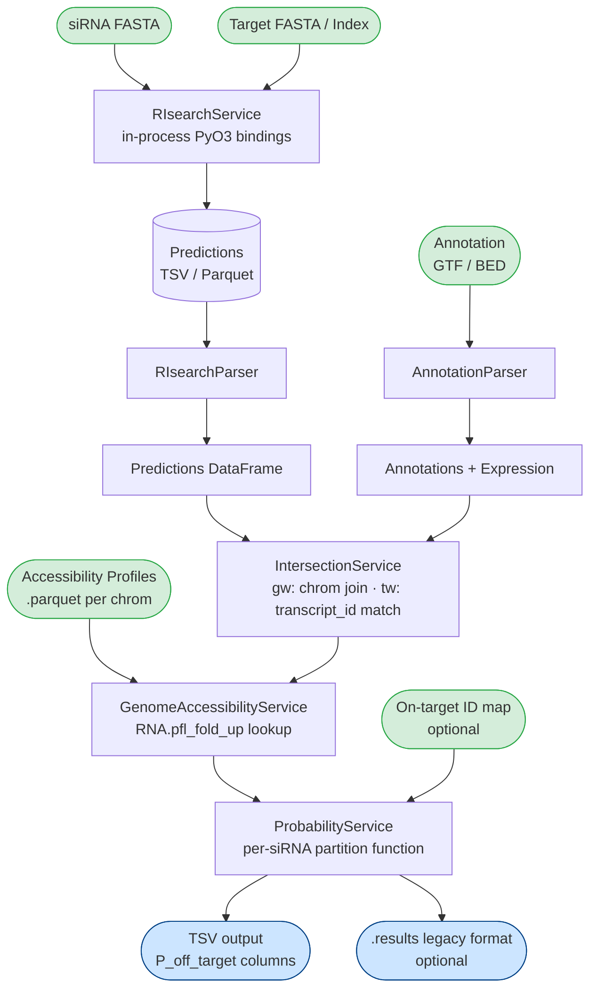

# RIsearch Pipeline

A bioinformatics pipeline for **siRNA off-target discovery and probability quantification**. Integrates RNA-RNA interaction predictions with transcriptome annotations, RNA accessibility profiling, and thermodynamic modeling to rank off-target binding sites.

---

## Pipeline Workflow



---

## Commands

### `off-targets` — Core Analysis

Loads RIsearch predictions, intersects them with a transcriptome, annotates RNA accessibility, and computes per-site off-target probabilities.

```bash
# From pre-computed predictions file
risearch-pipeline off-targets \
  -r predictions.tsv \
  -t transcriptome.gtf \
  -a accessibility_profiles/ \
  --on-target-id-map on_target_map.tsv \
  -o results.tsv

# Run RIsearch in-process (siRNA + target FASTA)
risearch-pipeline off-targets \
  -s sirna.fa \
  --target-fasta genome.fa \
  -t transcriptome.gtf \
  -a accessibility_profiles/ \
  -o results.tsv

# Via YAML config
risearch-pipeline -c config/off-targets.example.yaml
```

**Key options:**

| Flag | Description |
|------|-------------|
| `-r / --risearch-file` | Pre-computed predictions (TSV, `.out.gz`, or directory of Parquet) |
| `-s / --sirna-fasta` | siRNA FASTA — runs RIsearch in-process via PyO3 bindings |
| `-t / --transcriptome` | GTF or BED annotation file |
| `-a / --accessibility-dir` | Directory of per-chromosome accessibility Parquet files |
| `--expression-metric` | GTF attribute for expression weighting (default: `RPKM`) |
| `--mode` | `gw` (genome-wide) or `tw` (transcriptome-wide) |
| `--alpha / --gamma / --theta` | Parameter sweep values (semicolon-separated) |
| `--on-target-id-map / -oi` | TSV mapping `sirna_id → gene_id` for on-target normalization |
| `-j / --workers` | Parallel worker processes (default: CPU count) |

### `accessibility` — Pre-compute Profiles

Folds genome/transcriptome sequences with ViennaRNA (`RNA.pfl_fold_up`) and writes per-chromosome Parquet files for fast downstream lookup.

```bash
risearch-pipeline accessibility \
  --fasta genome.fa \
  --output profiles/ \
  --window 80 \
  --span 40 \
  --unpaired 30
```

Can also convert existing binary `.open.acc.bin` profiles to Parquet:

```bash
risearch-pipeline accessibility \
  --profiles-dir old_profiles/ \
  --risearch-dir predictions/ \
  --output profiles.parquet
```

---

## Installation

Requires **Python ≥ 3.14** and **ViennaRNA 2.7.2**.

```bash
# Clone with submodules (includes the Rust RIsearch core)
git clone --recurse-submodules https://github.com/your-org/RIsearch_pipeline.git
cd RIsearch_pipeline

# Create virtual environment and install all dependencies
uv venv && source .venv/bin/activate
uv sync

# Verify
risearch-pipeline --help
```

The `risearch` package is a local PyO3 binding built from the `risearch/` git submodule. `uv sync` compiles and installs it automatically.

### Optional: pre-build RIsearch binary

```bash
cargo install --path risearch/
```

The binary at `~/.cargo/bin/RIsearch` is used only for the legacy CLI path; in-process search via PyO3 bindings does not require it.

---

## Thermodynamic Model

Off-target probability is computed from a Boltzmann partition function over all predicted binding sites for each siRNA:

```
W_i  = Expression_i × exp(−ΔG_total_i / RT)

       ΔG_total = ΔG_hybridization + ΔG_opening

Z_s  = Σ W_i  (all off-targets of siRNA s)  +  W_on-target

P(off-target_i | siRNA_s) = W_i / Z_s
```

- **ΔG_hybridization**: RNA-RNA interaction energy from RIsearch (Turner 2004 parameters).
- **ΔG_opening**: Accessibility penalty — cost to unfold the target region, retrieved from pre-computed `RNA.pfl_fold_up` profiles.
- **Expression weighting**: GTF-derived RPKM/TPM values scale each site's contribution.
- **Per-siRNA normalization**: Partition functions are computed independently per siRNA; mixing them is biologically incorrect.

### Parameter sweeps

`--alpha`/`--gamma` clamp extremely favorable energies; `--theta` scales energy differences around a −10 kcal/mol reference. All combinations are computed in a single Polars `group_by` pass, producing separate `P_off_target:alpha=X,gamma=Y` columns.

---

## Output

### TSV (default)

| Column | Description |
|--------|-------------|
| `chrom` | Chromosome or transcript ID |
| `start`, `end` | Binding site coordinates |
| `strand` | Strand orientation |
| `energy` | Hybridization energy (kcal/mol) |
| `opening_energy` | Accessibility penalty (kcal/mol) |
| `dG_total` | Combined free energy |
| `exp_value` | Expression level |
| `P_off_target` | Off-target probability (baseline α=γ=θ=1) |
| `P_off_target:alpha=X,gamma=Y` | Per-parameter-set probabilities |

### Legacy `.results` (optional)

```
# On-target info for siRNA #
# For alpha=1.0 and gamma=1.0; Pon: 0.847; Poff: 0.153; ...
## End of on-target info ##
```

---

## Performance

| Dataset | Time | Memory |
|---------|------|--------|
| 1 k predictions | ~0.2 s | ~80 MB |
| 10 k predictions | ~0.8 s | ~145 MB |
| 100 k predictions | ~6.5 s | ~200 MB |

Key optimizations:
- **Polars** throughout — Rust-backed columnar operations, lazy query planning.
- **Parquet accessibility profiles** — memory-mapped columnar lookup, no full-file reads.
- **ProcessPoolExecutor with Arrow IPC** — per-siRNA files processed in parallel; workers share transcriptome pages via OS page cache.
- **Single `group_by` pass** — all parameter-sweep columns computed in one aggregation.

---

## Dependencies

| Package | Purpose |
|---------|---------|
| `polars` | High-performance DataFrames |
| `pyarrow` | Parquet I/O and Arrow IPC |
| `viennaRNA 2.7.2` | RNA folding (`RNA.pfl_fold_up`) |
| `numpy` | Memory-mapped array operations |
| `biopython` | FASTA parsing |
| `typer` | CLI framework |
| `rich` | Progress bars and terminal output |
| `loguru` | Structured logging |
| `omegaconf` | YAML config loading |
| `ncls` | Interval tree for genomic intersection |

---

## Related: Rust RIsearch Core

`risearch/` is a git submodule containing the Rust RIsearch binary and its PyO3 Python bindings. The pipeline calls the bindings **in-process** — no subprocess, no intermediate TSV. Features:

- Suffix-array based seed-and-extend search
- Turner 2004 thermodynamic parameters
- Multi-threaded parallel search via Rayon
- SIMD-optimized alignment kernels

---

## License

MIT
